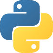
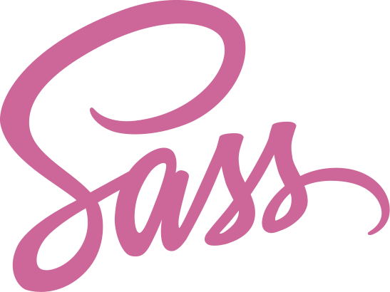
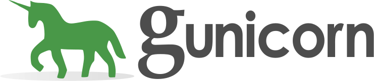

<h1 align="left">Hi 👋! My name is Jonas and I'm a Fullstack Developer from Luxembourg.</h1>

## About Me

- I am passionate about building scalable web applications and working with modern technologies.
- In my free time, I enjoy contributing to open-source projects and learning new programming languages.

---

## Skills & Tools

### Languages

  
  
  
  
  
  
  
  
  
  
  
  
  
  
  

## Frameworks & Libraries

  
  
  
  
  
  
  
  
  
  
  
  
  
  
  
  
  

## Databases

  
  
  
  
  

## DevOps & Deployment

  
  
  
  
  
  
  
  
  

## Build & Package Tools

  
  
  

## Collaboration & Project Management

  
  
  
  
  
  
  
  
  
  
  
  
  

---

###

  
  

###

 

###

<picture>
  <source media="(prefers-color-scheme: dark)" srcset="https://raw.githubusercontent.com/Jonas2134/Jonas2134/output/pacman-contribution-graph-dark.svg">
  <source media="(prefers-color-scheme: light)" srcset="https://raw.githubusercontent.com/Jonas2134/Jonas2134/output/pacman-contribution-graph.svg">
  
</picture>

###

  
  
  

###
