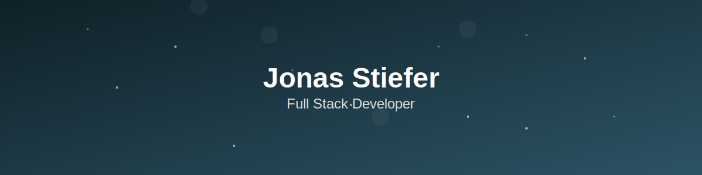
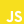
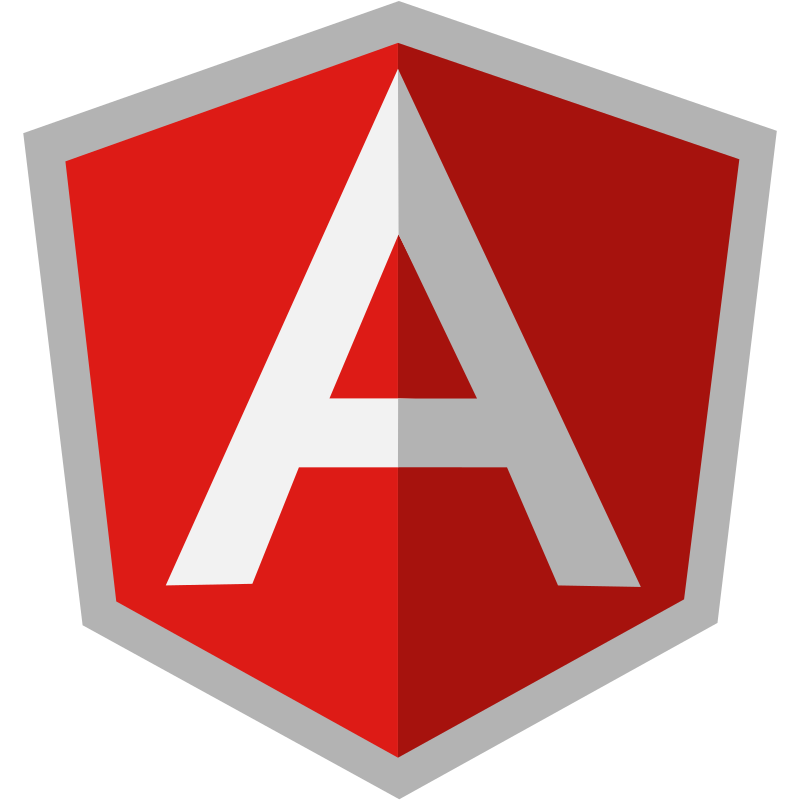
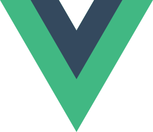

   

# Hi, I'm Jonas 👋

Welcome to my Profile!
I'm a Web Full-Stack Developer from Luxembourg.
I love coding and I'm always looking for new challenges and opportunities to learn new things.
My main focus is on web development, but I'm also interested in other areas of IT.
Feel free to check out my projects and skills below!

---

## Skills & Tools

  
  
  
  
  
  
  
  
  
  
  
  
  
  
  
  
  
  
  

 

---

## Contact Me

 

-  Here my [Linkedin](https://www.linkedin.com/in/jonas-stiefer-663b70252)
-  Here my [Gmail](mailto:neo.stief.jon@gmail.com)
-  Here is my [Discord](https://discord.com/users/301735021432012802) or my Discord Tag: **blindfischsan**

 

---

## My Snake

---
